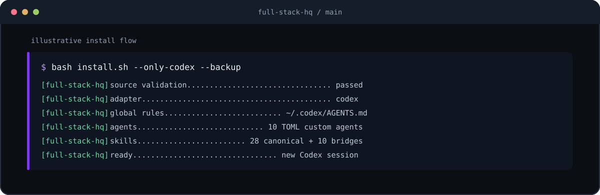
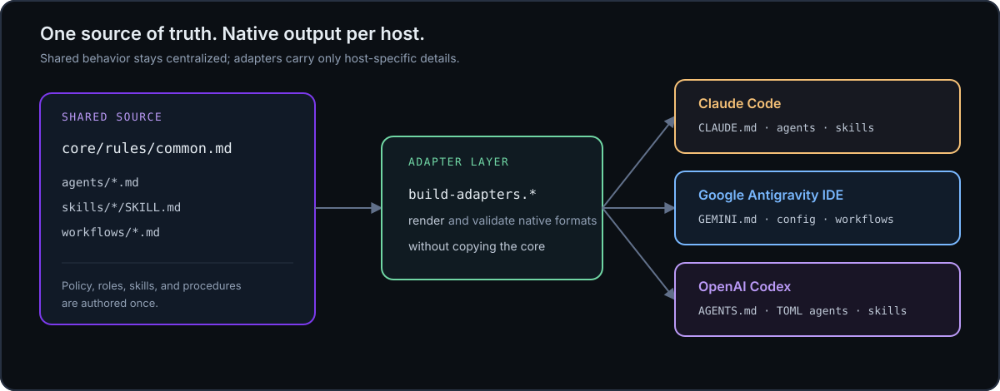
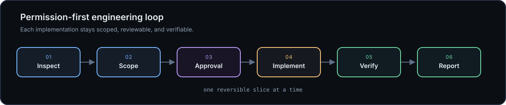

# Full Stack HQ

<div align="center">

<p><strong>One engineering core. Three AI-native hosts.</strong></p>

<p>Tool-agnostic, permission-first engineering configuration for<br />
Google Antigravity IDE, Claude Code, and OpenAI Codex.</p>

<p>
  <a href="#quick-start">Quick start</a> ·
  <a href="#architecture">Architecture</a> ·
  <a href="#whats-inside">What's inside</a> ·
  <a href="docs/SETUP.md">Setup guide</a> ·
  <a href="docs/LAUNCH_PLAYBOOK.md">Launch playbook</a>
</p>

<p>
  <a href="https://github.com/sabahattink/antigravity-fullstack-hq/actions/workflows/validate.yml"></a>
  <a href="https://github.com/sabahattink/antigravity-fullstack-hq/releases"></a>
  <a href="https://github.com/sabahattink/antigravity-fullstack-hq/stargazers"></a>
  <a href="LICENSE"></a>
</p>

</div>

> **The short version:** keep the engineering policy in one readable source,
> then render only the host-specific details each AI tool needs.

Full Stack HQ is a configuration and documentation kit for serious software
work. It gives AI coding hosts a shared operating model for planning,
specialist routing, implementation, testing, security, and verification while
preserving each host's native configuration format.

It is **not** a SaaS product, agent runtime, application framework, or hard
security boundary. The host still controls tools, approvals, sandboxing,
network access, and filesystem behavior.

<p align="center">
  
</p>

## Start here

### Try it safely in 60 seconds

Preview the Codex adapter without changing your real host configuration:

```powershell
git clone https://github.com/sabahattink/antigravity-fullstack-hq.git
Set-Location antigravity-fullstack-hq
.\install.ps1 -OnlyCodex -DryRun -TargetRoot .\.demo-home
```

macOS/Linux:

```bash
git clone https://github.com/sabahattink/antigravity-fullstack-hq.git
cd antigravity-fullstack-hq
bash install.sh --only-codex --dry-run --target-root ./.demo-home
```

This preview validates the source and shows the host files that would be
generated while keeping the real home directory untouched. When the result
looks right, continue with the [full setup guide](docs/SETUP.md), or test a
different host with `--only-claude` / `--only-antigravity`.

For the three reproducible first-run recipes, see
[First-run recipes](docs/FIRST_RUN.md).

<p>
  <a href="https://github.com/sabahattink/antigravity-fullstack-hq/issues/new?template=installation_feedback.md"><strong>Report an installation result</strong></a> ·
  <a href="https://github.com/sabahattink/antigravity-fullstack-hq/discussions"><strong>Join the discussion</strong></a> ·
  <a href="docs/DEMO_SCRIPT.md">Record the 45-second demo</a>
</p>

## The experience

The repository is designed to feel like a small engineering control plane:

```console
$ bash install.sh --only-codex --backup

FULL STACK HQ / CODEX ADAPTER
────────────────────────────────────────────────────────
 source      ✓  validated
 rules       →  ~/.codex/AGENTS.md
 agents      →  ~/.codex/agents/*.toml       10 specialists
 skills      →  ~/.agents/skills/            28 + 10 workflow bridges
 result      ✓  ready for a new Codex session

$ .\install.ps1 -OnlyClaude -Backup
```

The terminal above is a representative flow. Run the validator and installer
from a local checkout to see the exact output for your machine.

## Why this exists

| Principle | What it gives you |
|---|---|
| **One source of truth** | Shared engineering behavior lives in `core/`, not in three drifting copies. |
| **Native adapters** | Claude Code, Antigravity, and Codex receive the format and paths they understand. |
| **Permission-first** | The workflow asks for scope and approval before an approved implementation slice. |
| **Safe migration** | Existing files are preserved by default; backups, dry-runs, and legacy bridges are available. |
| **Evidence over confidence** | Validation and verification states distinguish changed, failed, and unverified results. |

## Architecture

<p align="center">
  
</p>

The core is the deep module: callers learn one stable engineering policy, and
each adapter carries only the details that genuinely vary. The existing
top-level `agents/`, `skills/`, and `workflows/` paths remain public so current
customizations and links continue to work.

### The source-to-host contract

| Source | Claude Code | Google Antigravity IDE | OpenAI Codex |
|---|---|---|---|
| Shared rules | `~/.claude/CLAUDE.md` | `~/.gemini/GEMINI.md` | `~/.codex/AGENTS.md` |
| Agents | `~/.claude/agents/` | `~/.gemini/config/agents/` | `~/.codex/agents/*.toml` |
| Skills | `~/.claude/skills/` | `~/.gemini/config/skills/` | `~/.agents/skills/` |
| Workflows | Generated skills | `~/.gemini/config/workflows/` plus bridge | Generated skills |
| Project guidance | `.claude/` / `CLAUDE.md` | `.agents/` | `AGENTS.md`, `.codex/`, `.agents/` |

The Codex adapter uses its current native formats: layered `AGENTS.md`
instructions, Agent Skills for reusable procedures, and TOML custom agents with
`name`, `description`, and `developer_instructions`.

<details>
<summary><strong>Native format references</strong></summary>

- [Codex AGENTS.md](https://learn.chatgpt.com/docs/agent-configuration/agents-md)
- [Codex Agent Skills](https://learn.chatgpt.com/docs/build-skills)
- [OpenAI Agent Plugins](https://learn.chatgpt.com/docs/build-plugins)
- [Codex custom agents](https://learn.chatgpt.com/docs/agent-configuration/subagents)
- [Agent Skills specification](https://agentskills.io/)
- [Claude Code skills](https://code.claude.com/docs/en/skills)
- [Antigravity rules and workflows](https://antigravity.google/docs/rules-workflows)

</details>

## Portable package

The repository root also contains a portable `plugin.json` manifest beside the
canonical `skills/` directory. Plugin-aware OpenAI hosts can consume that
package boundary without a second copy of the shared guidance. The regular
installers remain the complete path when you also want global rules, native
agents, Antigravity workflows, Codex TOML agents, backups, or dry-runs.

Read [the portable package guide](docs/PLUGIN.md) for the boundary, release
rules, and local validation checklist.

## Quick start

Choose one or more hosts. The default installs all three integrations.

### macOS / Linux

```console
$ git clone https://github.com/sabahattink/antigravity-fullstack-hq.git
$ cd antigravity-fullstack-hq
$ bash install.sh
```

### Windows PowerShell

```powershell
PS> git clone https://github.com/sabahattink/antigravity-fullstack-hq.git
PS> Set-Location antigravity-fullstack-hq
PS> .\install.ps1
```

### Install one host only

```console
# macOS / Linux
$ bash install.sh --only-codex
$ bash install.sh --only-claude
$ bash install.sh --only-antigravity
```

```powershell
# Windows PowerShell
PS> .\install.ps1 -OnlyCodex
PS> .\install.ps1 -OnlyClaude
PS> .\install.ps1 -OnlyAntigravity
```

### Safe upgrade controls

| PowerShell | Bash | Use it when you want to... |
|---|---|---|
| `-DryRun` | `--dry-run` | Preview changes without writing target files. |
| `-Backup` | `--backup` | Keep timestamped copies of replaced files. |
| `-Force` | `--force` | Replace managed files after reviewing the change. |
| `-TargetRoot DIR` | `--target-root DIR` | Test inside an isolated home-like directory. |
| `-NoLegacyPaths` | `--no-legacy-paths` | Skip refreshing an existing Antigravity legacy tree. |
| `-Check` | `--check` | Validate source and adapter generation before installing. |

For a conservative upgrade:

```console
# macOS / Linux
$ bash install.sh --dry-run
$ bash install.sh --force --backup
```

```powershell
# Windows PowerShell
PS> .\install.ps1 -DryRun
PS> .\install.ps1 -Force -Backup
```

Existing global instruction files are confirmed interactively. Existing agent
and skill files are kept unless `Force` is selected. Restart the host
application and start a new conversation after installation.

### Diagnose before installing

The read-only doctor checks the repository, adapter validator, host commands,
target paths, and Codex override precedence. Missing host files are reported as
warnings so it is useful both before a first install and after an upgrade.

```console
# Windows PowerShell
PS> .\scripts\doctor.ps1
PS> .\scripts\doctor.ps1 -OnlyCodex -TargetRoot .\tmp\host-home
```

```console
# macOS / Linux
$ bash scripts/doctor.sh
$ bash scripts/doctor.sh --only-codex --target-root ./tmp/host-home
```

Use `-Strict` / `--strict` when warnings should make the diagnostic fail.

## First run

<p align="center">
  
</p>

Use a small, reversible prompt to check that the configuration is loaded:

```text
Create a React component called UserCard
```

The intended engineering loop is:

```text
inspect → scope → approval → implement → verify → report
```

This is instruction-level guidance. It does not intercept shell commands or
guarantee runtime permissions.

## Help us test the host adapters

The most useful contribution is a real installation result, including a
successful dry-run or a small host-specific difference. Open the
[installation feedback form](https://github.com/sabahattink/antigravity-fullstack-hq/issues/new?template=installation_feedback.md)
with:

- the host and operating system;
- the command and Full Stack HQ version or commit;
- the expected and actual generated paths;
- a redacted log excerpt or screenshot, with tokens and private paths removed.

If you are comparing more than one AI coding host, continue the conversation
in [GitHub Discussions](https://github.com/sabahattink/antigravity-fullstack-hq/discussions)
so repeated questions can become documentation improvements.

## What's inside

| Directory / file | Role |
|---|---|
| `core/rules/common.md` | Host-neutral engineering policy and shared behavior. |
| `adapters/` | Thin Claude, Antigravity, and Codex integration layers. |
| `plugin.json` | Portable plugin manifest for the existing canonical skills. |
| `docs/assets/` | Repository-local terminal, architecture, and workflow visuals. |
| `agents/` | 10 canonical specialist role definitions. |
| `skills/` | 28 canonical Agent Skills for recurring engineering tasks. |
| `workflows/` | 10 canonical workflows and the Antigravity compatibility source. |
| `scripts/build-adapters.*` | Render host files and workflow skill bridges. |
| `scripts/validate.*` | PowerShell and Bash source/adapter validators. |
| `scripts/doctor.*` | Read-only environment and installation diagnostics. |
| `scripts/smoke-test.*` | Isolated all-host installer smoke tests. |
| `install.ps1` / `install.sh` | Safe, selective, cross-platform installers. |

### Specialist agents

| Agent | Focus |
|---|---|
| `frontend-specialist` | React, Next.js, Tailwind, and UI/UX |
| `backend-specialist` | NestJS, APIs, queues, and Redis |
| `database-specialist` | Prisma, PostgreSQL, and migrations |
| `architect` | System design, ADRs, and trade-offs |
| `code-reviewer` | Quality, patterns, and security |
| `test-engineer` | Vitest, Jest, and Playwright |
| `security-auditor` | Auth, OWASP, and input validation |
| `devops-engineer` | Docker, CI/CD, and deployment |
| `performance-optimizer` | Bundles, queries, and rendering |
| `documentation-writer` | Technical writing, READMEs, and ADRs |

### Canonical skills

The 28 skills are grouped around the work they support:

| Area | Skills |
|---|---|
| Frontend | `react-best-practices`, `typescript-patterns`, `tailwind-patterns`, `frontend-design`, `web-design-guidelines`, `nextjs-app-router` |
| Backend | `nestjs-patterns`, `backend-dev-guidelines`, `software-architecture`, `api-design-patterns`, `prisma-workflow` |
| Testing | `test-driven-development`, `systematic-debugging`, `webapp-testing` |
| DevOps | `docker-patterns`, `github-actions`, `deployment-guide` |
| Auth and security | `auth-patterns`, `security-checklist` |
| Documents | `docx-official`, `pdf-official`, `pptx-official`, `xlsx-official` |
| Meta | `brainstorming`, `skill-creator`, `code-review-patterns`, `git-workflow`, `prompt-engineering` |

### Workflow catalog

The canonical workflows remain in `workflows/`. They are also rendered as
skills so the same procedures can be used across all three hosts:

| Workflow | Purpose | Native invocation |
|---|---|---|
| `plan` | Break work into phases and approval checkpoints. | `/plan` · `$plan` |
| `brainstorm` | Explore options before implementation. | `/brainstorm` · `$brainstorm` |
| `create` | Implement an approved plan. | `/create` · `$create` |
| `debug` | Perform systematic root-cause analysis. | `/debug` · `$debug` |
| `enhance` | Improve existing code quality. | `/enhance` · `$enhance` |
| `test` | Design or improve meaningful tests. | `/test` · `$test` |
| `status` | Record progress, blockers, and next steps. | `/status` · `$status` |
| `preview` | Review quality, security, and readiness. | `/preview` · `$preview` |
| `orchestrate` | Coordinate specialist workstreams. | `/orchestrate` · `$orchestrate` |
| `ui-ux-pro-max` | Run a structured UI/UX review. | `/ui-ux-pro-max` · `$ui-ux-pro-max` |

The exact invocation is host-native: Antigravity and Claude commonly expose
slash commands, while Codex exposes skill selection and `$skill-name`
invocation.

## Compatibility and migration

- Existing top-level `agents/`, `skills/`, and `workflows/` paths remain intact.
- New Antigravity installations use documented `~/.gemini/config/` locations.
- An existing `~/.gemini/antigravity/` tree is refreshed as a compatibility
  bridge unless `--no-legacy-paths` / `-NoLegacyPaths` is selected.
- New installations do not create the legacy Antigravity tree.
- Codex user skills are installed under `~/.agents/skills/`.
- Codex global rules and custom agents use `CODEX_HOME` when it is set,
  otherwise the active `~/.codex/` directory.
- If `~/.codex/AGENTS.override.md` exists, Codex prioritizes it. The installer
  warns about the override and never overwrites it.
- The root `plugin.json` packages the existing `skills/` tree for
  plugin-aware hosts; it does not create a parallel source tree.

There is intentionally no separate Codex workflow directory. The canonical
workflow bodies are converted to Agent Skills because skills are the current
shareable workflow format.

## Verification

Validate the repository before installing or proposing a release:

```console
# Windows PowerShell
PS> .\scripts\validate.ps1
PS> .\install.ps1 -Check
```

```console
# macOS / Linux
$ bash scripts/validate.sh
$ bash install.sh --check
$ bash scripts/smoke-test.sh
```

```powershell
# Windows PowerShell
PS> .\scripts\smoke-test.ps1
```

The validators check:

- YAML frontmatter and name/path consistency.
- Skill and workflow metadata.
- Canonical content for accidental host-specific leakage.
- Codex TOML agent generation.
- Workflow-to-skill conversion counts.
- Antigravity rule-size limits and workflow/skill name collisions.
- Cross-platform renderer parity.

The smoke tests then install all three adapters into a disposable temporary
home and verify the generated rules, agents, skills, and workflows without
touching the real user configuration.

The repository also runs least-privilege validation on Windows and Ubuntu for
every push to `main` and every pull request.

## Documentation

- [Setup guide](docs/SETUP.md) — installation, upgrades, migration, and troubleshooting.
- [First-run recipes](docs/FIRST_RUN.md) — safe previews, isolated tests, and feedback.
- [Customization guide](docs/CUSTOMIZATION.md) — extend the core without creating drift.
- [Contributing guide](docs/CONTRIBUTING.md) — change discipline and verification.
- [Core and adapter design](core/README.md) — the source-of-truth model.
- [Portable plugin package](docs/PLUGIN.md) — package boundary and release rules.
- [Launch announcement pack](docs/ANNOUNCEMENT.md) — reviewable copy for GitHub and social channels.
- [Launch playbook](docs/LAUNCH_PLAYBOOK.md) — channel sequence, demo brief, and measurement plan.
- [Installation feedback](.github/ISSUE_TEMPLATE/installation_feedback.md) — structured host-specific reports.
- [Security policy](SECURITY.md) — reporting and security boundaries.
- [Changelog](CHANGELOG.md) — release history.

## Contributing

Please read [docs/CONTRIBUTING.md](docs/CONTRIBUTING.md) before opening a pull
request. Changes should remain focused on the core, adapters, installers,
validators, skills, agents, workflows, and documentation.

## License

MIT License. Maintained by [Sabahattin Kalkan](https://github.com/sabahattink).
